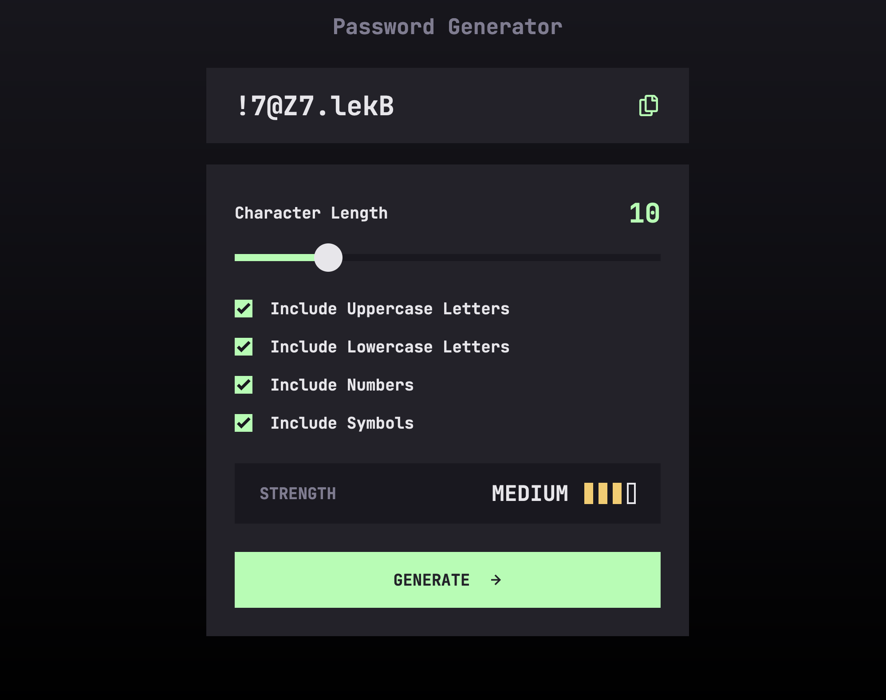

# Frontend Mentor - Password Generator App Solution

This is a solution to the [Password Generator App Challenge on Frontend Mentor](https://www.frontendmentor.io/challenges/password-generator-app-Mr8CLycqjh). Frontend Mentor challenges help you improve your coding skills by building realistic projects. 

## Table of contents

- [Overview](#overview)
  - [The Challenge](#the-challenge)
  - [Screenshot](#screenshot)
  - [Links](#links)
- [My Process](#my-process)
  - [Built With](#built-with)
  - [What I Learned](#what-i-learned)
  - [Continued Development](#continued-development)
  - [Useful Resources](#useful-resources)
- [Author](#author)

## <a name="overview"></a>Overview

### <a name="the-challenge"></a>The Challenge

Users should be able to:

- Generate a password based on the selected inclusion options
- Copy the generated password to the computer's clipboard
- See a strength rating for their generated password
- View the optimal layout for the interface depending on their device's screen size
- See hover and focus states for all interactive elements on the page

### <a name="screenshot"></a>Screenshot



### <a name="links"></a>Links

- Solution URL: [Add solution URL here](https://your-solution-url.com)
- Live Site URL: [https://aaron-romanick.github.io/password-generator-app/](https://aaron-romanick.github.io/password-generator-app/)

## <a name="my-process"></a>My Process

### <a name="built-with"></a>Built With

- Semantic HTML5 markup
- CSS custom properties
- Flexbox
- Mobile-first workflow
- [SASS](https://sass-lang.com/) - CSS with superpowers
- [TypeScript](https://www.typescriptlang.org/) - Javascript with syntax for types
- [Vite](https://vitejs.dev/) - Next Generation Frontend Tooling
- [zxcvbn](https://github.com/dropbox/zxcvbn) - A password strength estimator inspired by password crackers

### <a name="what-i-learned"></a>What I Learned

While creating this app wasn't heading into any altogether new territory, I was aware that passwords/cryptography were in some ways a delicate field. I knew to generate a password, I shouldn't go about using `Math.random()` as it isn't cryptographically secure. That's when I started looking into the [crypto](https://developer.mozilla.org/en-US/docs/Web/API/crypto_property) module in JavaScript. With it I was able to learn through a variety of useful online materials about how to generate a random  (cryptographic) number to use to generate a random password. I also came up with a way to guarantee that a minimum amount of each type of included character (ie: numbers, lowercase letters, etc) makes it into the password:

```js
const forceAllIncludedChars = (completePasswordLength: number, options: IncludedCharOptions) => {
  const holdingArray = []
  for(let i = 0; i < MIN_MANDATORY_ALLOWED_CHARACTERS; i++) {
    let str = ''
    if(options.lowercase) { str += getRandCharFromString(LOWERCASE) }
    if(options.uppercase) { str += getRandCharFromString(UPPERCASE) }
    if(options.numbers) { str += getRandCharFromString(NUMBERS) }
    if(options.symbols) { str += getRandCharFromString(SYMBOLS) }
    holdingArray.push(cryptoShuffle(str))
  }
  const holdingStr = holdingArray.join('')
  return holdingStr.length > completePasswordLength
    ? holdingStr.substring(0, completePasswordLength) : holdingStr
}
```

To test password strength, at first I was going to homebrew my own functionality based on how many characters types were being used as well as password length. However, as [someone famously once said](https://xkcd.com/936/), amount of character types don't really mean much nowadays when it comes to password hacking. So I stumbled upon and implemented Dropbox's password strength checker, [zxcvbn](https://github.com/dropbox/zxcvbn), which happens to be open source!

Another challenge for me was creating the styles for the character length range slider. Through my research I found that many browsers have differing pseudo elements to handle things like the *thumb* and the *track*. What's more is that certain browsers don't have a way to differentiate between the left and right part of the track, so I ended up custom building my own. In order to accomodate all browsers as best as I could, I ended up making an `@each` loop in SASS since the pseudo-selectors cannot be combined:

```scss
$thumbs: -webkit-slider-thumb, -moz-range-thumb, -ms-thumb;
  @each $thumb in $thumbs {
    &::#{$thumb} {
      @if($thumb == -webkit-slider-thumb) {
        -webkit-appearance: none;
      }
      background-color: var(--dm-form-range-thumb);
      border: var(--size-5) solid transparent;
      border-radius: var(--size-max);
      box-shadow: none;
      cursor: pointer;
      height: var(--size-70);
      transition: border-color var(--speed-fastest),
                  background-color var(--speed-fastest);
      width: var(--size-70);

      &:hover {
        border-color: var(--dm-form-accent);
        background-color: var(--dm-form-range-runner-track-bg);
      }
    }
  }
```

This was also my first time developing functionality with the system clipboard. At first, I though it should be a fairly simple task, but I didn't think about the security ramifications that could come with it. However, since I wasn't going to be reading from the clipboard and this project would be hosted on a secure site, it didn't take long to work out what to do.

### <a name="continued-development"></a>Continued Development

In this app, I set the max possible characters to 50, because if passwords get too long (60+ characters), [zxcvbn](https://github.com/dropbox/zxcvbn) seems to get really bogged down and the app starts to chug a little big. Also, if passwords exceed the input field size, they get hidden away (their still there though!). While I know some other password generators cut off access characters from display as well, I'm not quite satisfied with the asthetic and would like to continue thinking of a better approach. Lastly, it's probably be better to put in some sort of error message display for if the copy function doesn't work; as of right now, it just displays an error message in the console, which isn't much help for the average user.

### Useful Resources

#### JavaScript Crypto Module

- [Javascript: Generate a random number within a range using crypto.getRandomValues](https://stackoverflow.com/questions/18230217/javascript-generate-a-random-number-within-a-range-using-crypto-getrandomvalues)
- [How to randomize (shuffle) a JavaScript array?](https://stackoverflow.com/questions/2450954/how-to-randomize-shuffle-a-javascript-array)

#### CSS Custom Range Slider / Checkboxes

- [Styling Cross-Browser Compatible Range Inputs with CSS](https://css-tricks.com/styling-cross-browser-compatible-range-inputs-css/) - This helped me for XYZ reason. I really liked this pattern and will use it going forward.
- [How to style HTML5 range input to have different color before and after slider?](https://stackoverflow.com/questions/18389224/how-to-style-html5-range-input-to-have-different-color-before-and-after-slider)
- [Pure CSS Custom Checkbox Style](https://moderncss.dev/pure-css-custom-checkbox-style/)

#### Password Strength Checking
- [Low-Budget Password Strength Estimation](https://github.com/dropbox/zxcvbn)

#### JavaScript Clipboard API

- [How to Copy to Clipboard in JavaScript with the Clipboard API](https://stackabuse.com/how-to-copy-to-clipboard-in-javascript-with-the-clipboard-api/)
- [Type PermissionName for Permission API doesn't contain correct types](https://github.com/microsoft/TypeScript/issues/33923)

## <a name="author"></a>Author

- Website - [Aaron Romanick](https://www.aaronromanick.com)
- Frontend Mentor - [@aaron-romanick](https://www.frontendmentor.io/profile/aaron-romanick)
